# DSH Math Modeling Team Plugin Pack

Team-based math modeling workflow plugins for **DeepSeek Harness**. It distills the methodologies of mature math-modeling skill repos into **2 installable agent presets**, paired with a **multi-folder Git collaboration** model (Gitee/GitHub), so multiple people can work independently in their own workspaces without interference.

Hosted under the GitHub Topic: **`dsh-plugin`**.

> 简体中文说明见 [README.md](README.md) | English docs below.

## What this is

In DeepSeek Harness, an **agent preset** is a role configuration: a persona (job responsibility), a set of tools, and **Skills** (role capability documents) installed with the preset. Each session that picks a preset gains that role's full capability set.

This pack provides **2 role presets**:

| Preset dir | Role | Who | Core capabilities |
|---|---|---|---|
| `presets/model-code` | Modeling + Programming Agent | 2 modeling/coding members (shared) | Problem analysis, model building, Python/MATLAB solving, results & figures, reproducibility manifest; includes modeler/coder/algorithm/viz docs |
| `presets/paper` | Paper Agent | 1 paper-writing member | Paper writing (Word/LaTeX), evidence retrieval & verification, independent review gate; includes paper-writer/award-review/evidence-search docs |

### Each preset contains
- `agent.cordis.yml` — Harness capability baseline (derived from the shipped `cordis` preset: shell / fs / jobs / subagent collaboration / web search / skill loading, etc.)
- `preset.yml` — preset metadata (name, description)
- `skills/<name>/SKILL.md` — the role's primary skill (responsibilities, workflow, quality gates, collaboration rules)
- `skills/<name>/references/` — methodology docs installed with the preset (loaded on demand)

### Key features
- **Team collaboration**: preset embeds a "3-folder Git repo" protocol (`member-a/`, `member-b/`, `member-c/`) — each member commits only their own folder, no interference
- **Quality gates**: Modeling final-check M1 / minimal runnable P1 / **robustness attack final-check M2** / coding final-check P2 / evidence outline W1 / paper final-check W2
- **M2 robustness attack final-check**: systematically "attack" every core model — propose model → attack model → re-verify with an alternative method → add uncertainty → out-of-sample test → state the applicability boundary — to keep conclusions that cannot survive scrutiny out of the paper (with real 2023 CUMCM-C attack cases)
- **Vision sub-agent (mandatory image-review gate)**: when the main model does not accept image input, dispatch a sub-agent on a **vision-capable model in the current environment** via `workflow` (auto-probe models whose `inputModalities` includes `image`; `opencode-go/mimo-v2.5` was validated on this host, but model names are not hardcoded). **Every formal figure must be reviewed one-by-one by the vision sub-agent to PASS with records before P2/W2**; on FAIL, a "fix → re-review" loop runs until PASS — figures that skipped image review cannot pass the final-check gates
- **Independent-model review (adversarial)**: adversarial critique by a model from a **different vendor** — factuality / consistency / completeness / **model attack** / citation check; fabricated numbers are blocked on the spot (recommended: `kimi-coding/k3-256k` on this host)

## Independent review model (adversarial)

**Why**: a model that both produces and accepts has no critical distance — fabricated numbers, inconsistent definitions, and contradictions go unnoticed. Reviewing from a **different vendor's model** is like a second pair of eyes.

**How**: dispatch a review sub-agent via `workflow`'s `agent(prompt, { provider, model })`, pinned to a model different from the producer (recommended `kimi-coding/k3-256k` on this host; do not hardcode — probe with the `llm` service for an available different-vendor model on another deployment).

**Review dimensions**:
- **Factuality**: can the headline numbers be traced to `results/` and the figures? Any fabrication?
- **Consistency**: are definitions/symbols/conclusions coherent across summary, body, tables, and figures?
- **Completeness**: do all sub-problems get covered?
- **Model attack**: question each core model's assumptions (instrument validity / key parameter values / baseline dependence / stockout truncation / share stability) and verify the stated applicability boundary
- **Citation check**: do references exist and are they cited correctly?

**Blocked instance (2023 CUMCM-C run)**: a fabricated number "0.78" in a draft was flagged (not present in the data) → removed, replaced with the honest interval (0.7, 0.8).

**Relation to M2**: M2 (modeling role) attacks the models at production time; independent review (paper role) re-checks the paper with a different model at delivery time — two lines of defense, front and back.

## Reusable global skill

The repo ships a directory installable as a **global skill** (drop it under a DSH shared user skill root; any preset discovers it):

- `skills/vision-subagent/` — vision sub-agent (visual QA). Install:
  ```bash
  # Copy to the DSH shared user skill root; any preset session auto-discovers it
  cp -R skills/vision-subagent ~/.agents/skills/vision-subagent
  # Windows:
  # Copy-Item -Recurse .\skills\vision-subagent "$env:USERPROFILE\.agents\skills\vision-subagent"
  ```
  DSH's `dsh-skill-filesystem` scans `~/.agents/skills/`, `~/.dsh/skills/`, project `.dsh/skills`, etc.; once placed, it is discovered automatically — no config change needed.

## Installation

### Prerequisites
- DeepSeek Harness (dsh) installed
- Quit dsh, or restart the session after install for changes to take effect

### Method 1: copy the folders (recommended)
Copy `presets/` into your user preset root:
```powershell
# Windows
Copy-Item -Recurse .\presets\model-code "$env:USERPROFILE\.dsh\.agent-presets\model-code"
Copy-Item -Recurse .\presets\paper "$env:USERPROFILE\.dsh\.agent-presets\paper"
```
```bash
# macOS / Linux: copy into $HOME/.dsh/.agent-presets/
mkdir -p "$HOME/.dsh/.agent-presets"
cp -R presets/model-code presets/paper "$HOME/.dsh/.agent-presets/"
```

### Method 2: manual copy
Place the `presets/model-code` and `presets/paper` folders verbatim into `~/.dsh/.agent-presets/`, keeping the directory names unchanged.

### Verify installation
Restart dsh and open a new session: the preset picker should list **`建模编程 Agent`** (Modeling-Coding Agent) and **`论文 Agent`** (Paper Agent). Validate via the `agentPresets` service:
```js
await agentPresets.standingKeyFor('model-code')  // no throw = success
await agentPresets.standingKeyFor('paper')
```

## Quick start (team collaboration mode)

1. Create an empty private repo on Gitee/GitHub (shared by the team)
2. On first clone, initialize the `member-a/`, `member-b/`, `member-c/` three-folder baseline per `docs/team-collaboration.md`
3. 2 members open `model-code` preset sessions in separate workspaces, each cloning the repo and committing their own modeling+coding deliverables to their `member-*` folder, then push
4. The paper member opens a `paper` preset session, `git pull`s A & B's deliverables, writes the paper in `member-c/`, and pushes
5. Everyone commits only their own `member-*` folder — no interference

Per-role kickoff prompt templates: see `docs/team-collaboration.md`.

## Full workflow (two presets + team collaboration)

### Detailed flowchart

```mermaid
flowchart LR
    subgraph team["Team (3 people · 3 independent workspaces)"]
        direction TB
        A["Member A (model-code preset)"]
        B["Member B (model-code preset)"]
        C["Member C (paper preset)"]
    end

    subgraph mc["📐 Modeling & coding role (model-code)"]
        direction TB
        S1["① Modeling phase<br/>read problem → check attachments → split sub-problems<br/>→ choose models → design solve & verify plan"]
        G1["M1 modeling final-check<br/>requirements covered?<br/>sub-problems complete? correct criteria?"]
        D1["Deliver: problem analysis report.md<br/>term table.md"]
        S2["② Coding kickoff<br/>data prep (cleaning/returns/outliers)<br/>→ minimal runnable code → real run"]
        G2["P1 minimal runnable<br/>real results produced?"]
        S3["③ M2 robustness attack final-check<br/>identify attack points → alternative methods → intervals<br/>→ out-of-sample test → applicability boundary"]
        G3["M2 pass criteria<br/>attack list/alt methods/intervals<br/>/out-of-sample/boundary all present"]
        S4["④ Full-scale compute & figures<br/>3 figure types (raw/process/result)<br/>≥3 each covering all sub-problems"]
        S5["⑤ Figure QA<br/>vision sub-agent one-by-one review (mandatory)"]
        G4["P2 coding final-check<br/>real results · complete reproducibility manifest<br/>figures skipped image review → fail"]
        D2["Deliver: results/ tables + reproducibility manifest.json<br/>figures/ 3 types"]
        S1 --> G1 --> D1 --> S2 --> G2 --> S3 --> G3 --> S4 --> S5 --> G4 --> D2
    end

    subgraph pp["📄 Paper role (paper)"]
        direction TB
        T1["① Pull A/B deliverables<br/>git pull member-a/b"]
        T2["② Build evidence base<br/>read analysis report/results/figures<br/>per-sub-problem evidence list + gap log"]
        T3["③ Evidence search & verify<br/>multi-source search → dedup → cross-check citations"]
        T4["④ W1 evidence outline<br/>structure × evidence mapping<br/>+ model defense checklist (maps to M2)"]
        G5["W1 pass criteria<br/>evidence per chapter · no orphan conclusions<br/>defense checklist complete"]
        T5["⑤ Write paper<br/>Word (OMML) / LaTeX (optional)<br/>official template adaptation → render PDF"]
        T6["⑥ Figure QA<br/>vision sub-agent one-by-one review (mandatory)"]
        T6b["⑦ Rendered-PDF page review (mandatory)<br/>each page → image → vision sub-agent per-page<br/>table overflow / bad fonts / tiny fonts / layout / blank pages"]
        T7["⑧ Independent review<br/>different-vendor adversarial review<br/>(kimi-coding/k3-256k)"]
        G6["W2 paper final-check<br/>formulas↔results · no empty fig/table<br/>numbering/citations continuous · boundary stated<br/>figure-review records · rendered-PDF review PASS · independent review PASS"]
        D3["Deliver: final paper.docx/pdf<br/>review record.md · code appendix · AI-use disclosure"]
        T1 --> T2 --> T3 --> T4 --> G5 --> T5 --> T6 --> T6b --> T7 --> G6 --> D3
    end

    D2 -->|"git add member-a/b<br/>commit · push"| REPO["Git repo<br/>member-a / member-b / member-c"]
    REPO -->|"git pull (read-only others)"| T1
    V1["🖼️ Vision sub-agent (global skill)<br/>probe vision model → read_image<br/>FAIL → fix → re-review → PASS"]
    V2["⚔️ Independent review model<br/>factuality/consistency/completeness<br/>model attack/citation check"]
    V1 -.-> S5
    V1 -.-> T6
    V2 -.-> T7
```

### Gate check details

| Gate | Role | What it checks |
|---|---|---|
| **M1 modeling final-check** | modeling/coding | All problem requirements have a model/plan; no sub-problem missed; constraints & criteria understood correctly |
| **P1 minimal runnable** | modeling/coding | Minimal code runs before full-scale compute and produces real results |
| **M2 robustness attack final-check** | modeling/coding | Core models survive systematic attack: identify threats (3-5 attack points, e.g. instrument validity / elasticity value / baseline dependence / stockout truncation / share stability) → alternative-method verification → uncertainty intervals → out-of-sample test → applicability boundary; attack list complete to pass |
| **P2 coding final-check** | modeling/coding | All sub-problems have real results & figures; numbers traceable; reproducibility manifest complete; **all formal figures reviewed by vision sub-agent to PASS with records** |
| **W1 evidence outline** | paper | Structure × evidence (fig/table/conclusion) mapping; no orphan conclusions; **model defense checklist included** (maps to M2 attack results) |
| **W2 paper final-check** | paper | Formulas↔results consistent; no empty figs/tables; figures cover all sub-problems; numbering/citations continuous; references bidirectional; applicability boundary stated; **all figures reviewed by vision sub-agent to PASS with records**; **rendered-PDF per-page review PASS with records** (table overflow / bad fonts / tiny fonts / layout / blank pages); independent review results merged |

### Mandatory image review / rendered-PDF review / independent review (cross-cutting)

- **Vision sub-agent (mandatory image-review gate)**: when the main model cannot read images, auto-probe a vision model whose `inputModalities` includes `image` (validated: `opencode-go/mimo-v2.5`; not hardcoded), dispatch a vision sub-agent via `workflow` to review every formal figure one-by-one (title/axes/legend/data/blank-overlap/claim support). **FAIL → fix per defects → re-review, loop until PASS**; each "FAIL reason → fix action → re-review result" is recorded. **Required in both P2 and W2: figures that skipped image review cannot pass the final-check gates.**
- **Rendered-PDF page review (mandatory)**: after the final PDF is produced, render every page to an image (pdftoppm/PyMuPDF, 300 DPI) and have the vision sub-agent review **each page** — table overflow/truncation, abnormal fonts (mojibake/missing glyphs), unreadably small fonts, layout issues (overlap/misalignment/orphan lines), blank/duplicate pages, header/footer anomalies, blurry/cropped images, bad page breaks. FAIL → fix layout → re-render → re-review page by page, until all PASS; records kept. **Required in W2: papers that skipped rendered-PDF page review do not pass.** (More checks: see `self-review framework` / `LaTeX format spec` docs)
- **Independent review model (adversarial)**: adversarial critique by a **different-vendor** model (recommended `kimi-coding/k3-256k`) — factuality (numbers traceable / no fabrication), consistency (definitions coherent), completeness (sub-problems covered), **model attack** (question instrument validity / parameter values / baseline dependence / stockout truncation / share stability), citation check (references exist & cited correctly). Must run before W2; fabricated numbers are blocked on the spot.

### Collaboration essentials

- **3 independent workspaces + 1 Git repo + 3 folders** (member-a/b/c); each commits only their own folder — no interference
- Deliverable contract: modeling/coding 6 items (analysis report / term table / scripts / results / figures / reproducibility manifest); paper 4 items (evidence outline / paper / review record / AI-use disclosure)
- Bounded iteration: max 2 fix rounds per review; when the budget is exhausted, output a decision memo — never infinite polishing

## Documentation

- [Vision sub-agent](docs/vision-subagent.md) — vision review when the main model cannot read images
- [Team collaboration](docs/team-collaboration.md) — 3-folder collaboration protocol, handoff contract, per-role prompts
- [Attribution](docs/attribution.md) — methodology provenance from the two reference repos
- [Sample run record](docs/sample-run.md) — a full end-to-end run on the real 2023 CUMCM Problem C

## Sample showcase

Result of a full end-to-end run on the real **2023 CUMCM Problem C (Vegetable Pricing & Restocking)** — see [sample run](docs/sample-run.md) for the full pipeline and data:

- [Sample paper `examples/sample-paper.pdf`](examples/sample-paper.pdf) — 33-page final paper (XeLaTeX, 18 figures)
- `examples/figures/` — 15 result figures covering **raw / process / result** stages and all of Q1–Q3:

**Q1 Sales distribution & relationships**

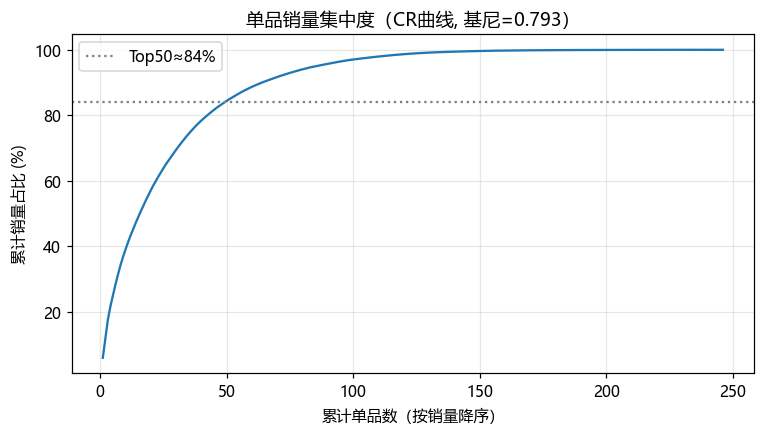

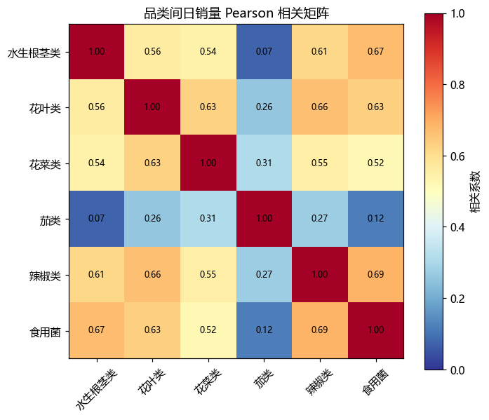

| | |
|---|---|
| 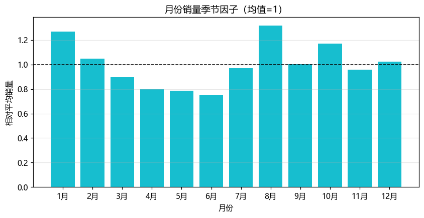 | 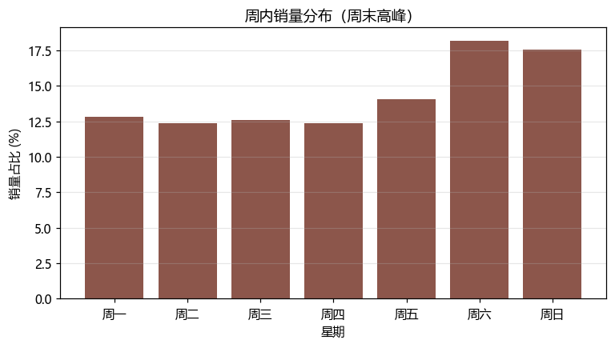 |
| **Seasonal factor** (summer/CNY peaks) | **Day-of-week factor** (weekend peak) |

| | |
|---|---|
| 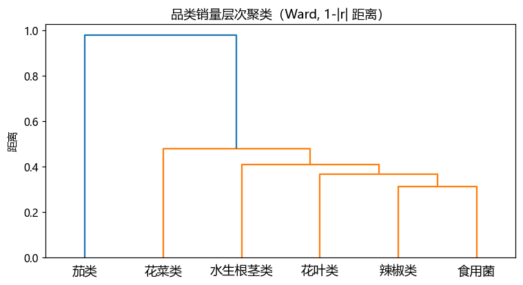 | 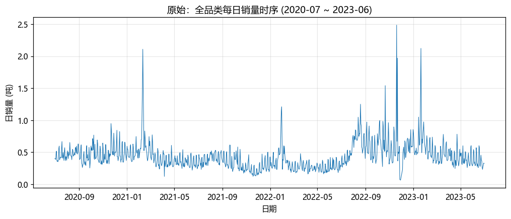 |
| **Category clustering** | **Raw daily sales series** |

**Q2 Category price-volume & restocking/pricing**

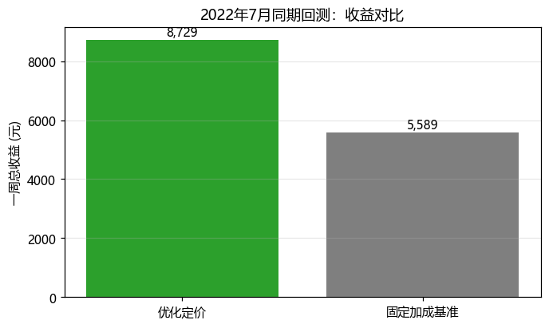

| | |
|---|---|
| 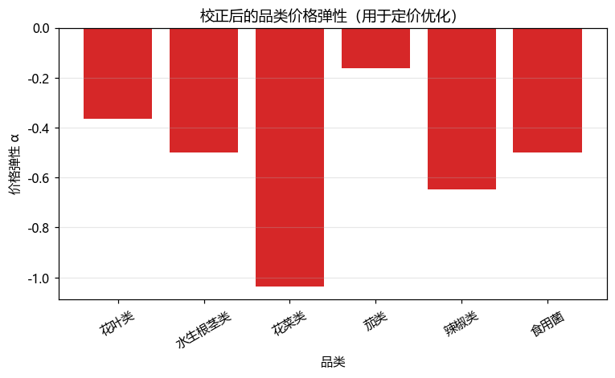 | 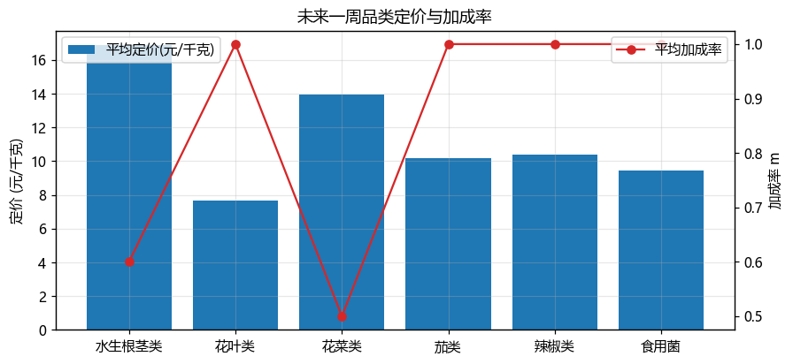 |
| **Price elasticity** | **Category mark-up pricing** |

**Q3 Single-item restocking & pricing**

| | |
|---|---|
| 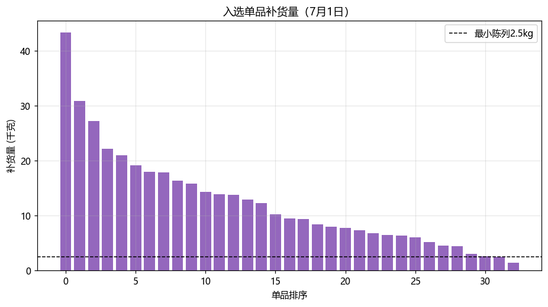 | 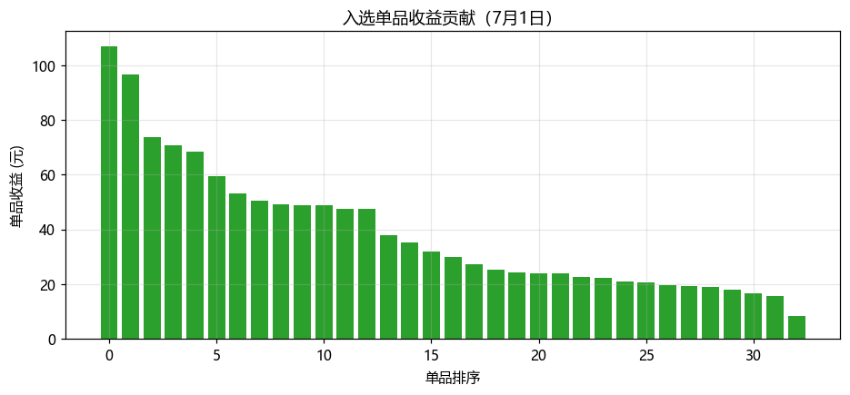 |
| **Selected-item restock volume** | **Item profit** |

| | |
|---|---|
| 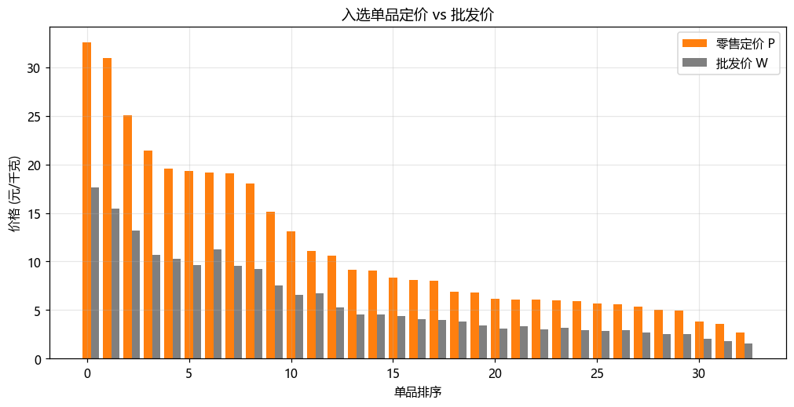 | 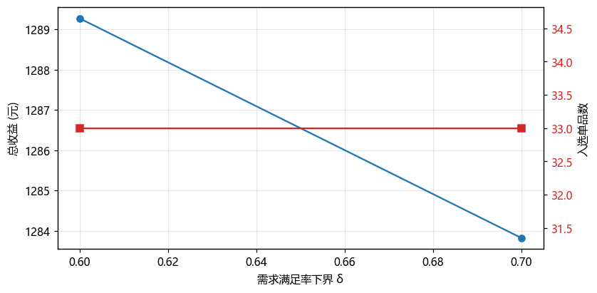 |
| **Item pricing** | **Satisfaction-revenue sensitivity** |

## Methodology attribution

The role methodology docs in this pack are distilled from (docs only; no scripts/tool sources are shipped):

- [XiaoMaColtAI/math-modeling-skill](https://github.com/XiaoMaColtAI/math-modeling-skill) — 3-stage workflow (modeling/coding/paper), quality gates, algorithm library, scientific-viz spec, reproducibility manifest
- [sweetcornna/mathodology](https://github.com/sweetcornna/mathodology) — award-grade review gates (blind judging / bounded iteration), evidence search, full workflow methodology

## License

MIT (most permissive; attribution required)
